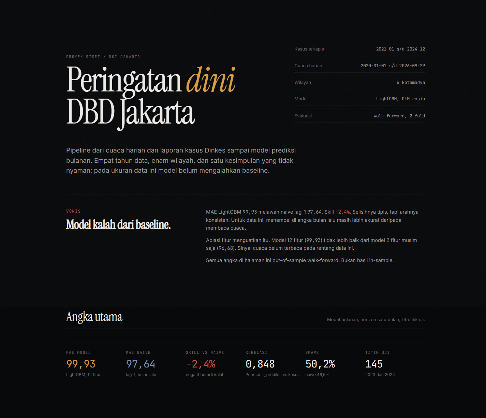
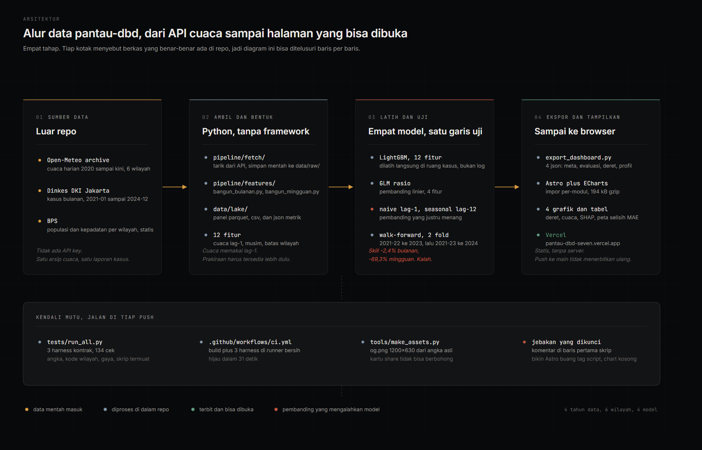
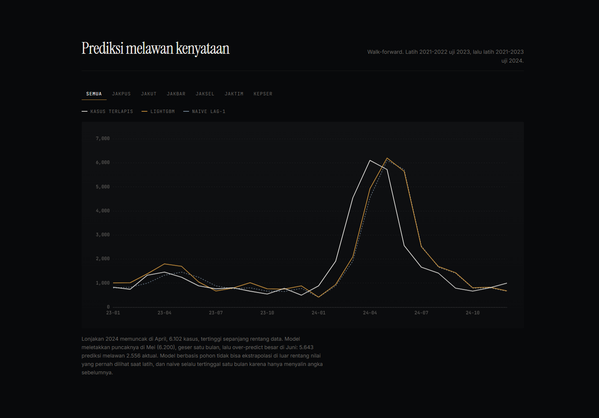
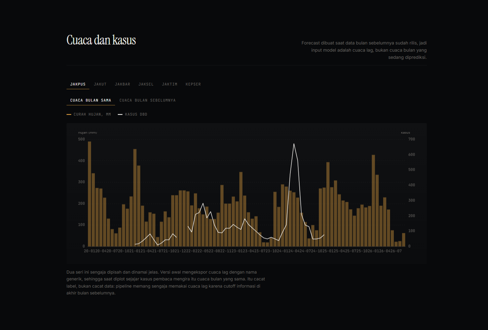
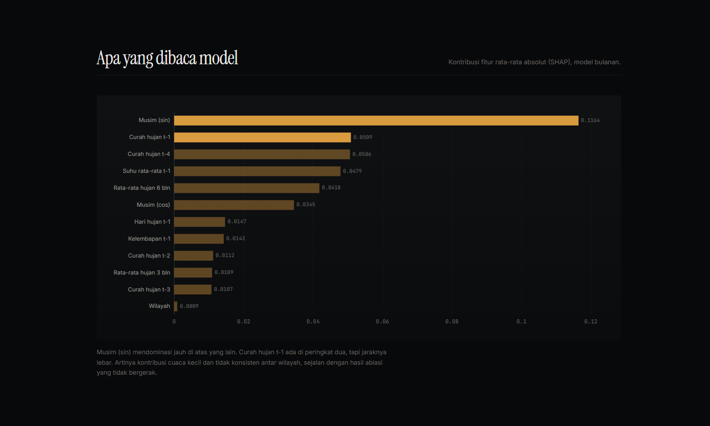
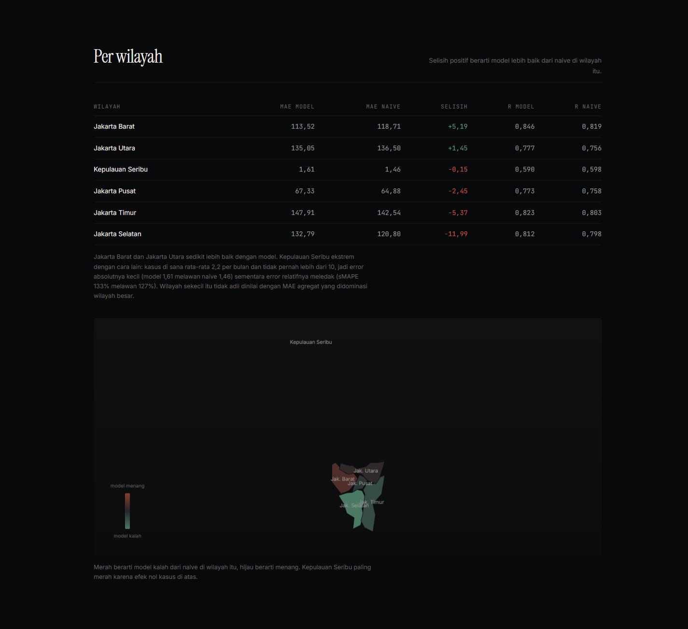
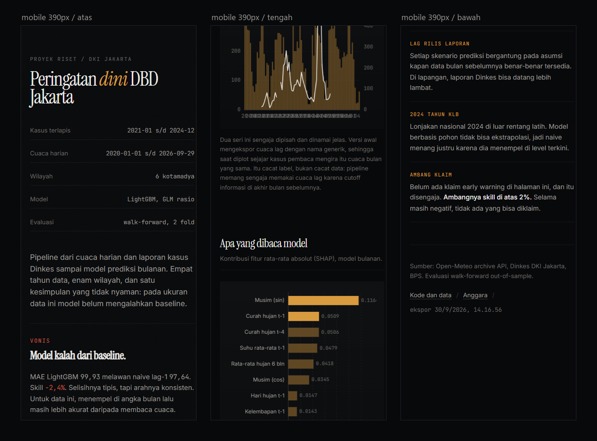

# pantau-dbd

[](https://github.com/4RGY/pantau-dbd/actions/workflows/ci.yml)

Peringatan dini demam berdarah dengue untuk DKI Jakarta. Cuaca harian dan laporan kasus
Dinkes masuk ke pipeline Python, keluar jadi prediksi kasus per kotamadya dan satu
dashboard statis yang bisa dibuka siapa saja.

**Live:** https://pantau-dbd-seven.vercel.app

**Status: tahap riset.** Model belum mengalahkan baseline naive, dan itu disebut di depan
halaman, bukan disembunyikan di catatan kaki. Semua angka di README ini apa adanya,
termasuk yang jelek.



## Kenapa proyek ini ada

DBD di Jakarta berulang tiap tahun dan memuncak di musim hujan. 2024 jadi tahun terburuk
dalam rentang data ini: puncaknya 6.102 kasus di bulan April, tertinggi sepanjang 2021
sampai 2024.

Pertanyaannya sederhana. Kalau cuaca harian ditambahkan ke model yang sudah tahu jumlah
kasus bulan lalu, apakah prediksinya membaik?

Jawabannya, pada ukuran data ini: belum. Bukan karena cuaca tidak relevan, tapi karena
empat tahun data bulanan terlalu pendek dan autokorelasi kasus sudah sangat kuat. Naive
lag-1 menangkap hampir semua sinyal yang bisa ditangkap. Hasil negatif seperti ini jarang
dipublikasikan, dan repo ini sengaja disusun supaya bisa diperiksa orang lain, bukan cuma
dipercaya.

## Isi repo

| Folder | Isinya |
|---|---|
| `pipeline/fetch/` | tarik cuaca dari Open-Meteo, simpan mentah ke `data/raw/` |
| `pipeline/features/` | bangun panel bulanan dan mingguan, ekspor JSON dashboard |
| `pipeline/train/` | latih LightGBM dan GLM, evaluasi walk-forward |
| `dashboard/` | situs Astro, membaca JSON dari `dashboard/public/data/` |
| `tests/` | tiga harness kontrak, jalan di CI |
| `tools/` | pembuat aset sosial, pemotong tangkapan layar, sumber diagram |
| `data/raw/` | data mentah |
| `data/lake/` | turunan: parquet, csv, json metrik |
| `models/` | model terlatih |

## Arsitektur



Empat tahap. Tiap kotak di diagram itu menyebut berkas yang benar-benar ada di repo, jadi
alurnya bisa ditelusuri baris per baris.

1. **Sumber.** Cuaca harian dari Open-Meteo archive API (2020-01-01 sampai sekarang, 6
   kotamadya), kasus bulanan dari Dinkes DKI Jakarta (2021-01 sampai 2024-12), populasi
   dan kepadatan dari BPS. Tidak ada API key di proyek ini.
2. **Ambil dan bentuk.** `pipeline/fetch/` menyimpan data mentah, `pipeline/features/`
   membangun panel. 12 fitur: cuaca lag-1, penanda musim, dan batas wilayah.
3. **Latih dan uji.** Empat model dibandingkan di garis uji yang sama: LightGBM (12
   fitur), GLM rasio (4 fitur), dan dua baseline naive (lag-1, seasonal lag-12).
   Walk-forward dua fold: latih 2021-2022 uji 2023, lalu latih 2021-2023 uji 2024.
4. **Ekspor dan tampilkan.** `export_dashboard.py` menulis empat JSON (meta, evaluasi,
   deret, profil) yang dibaca dashboard Astro. Statis, tidak ada server yang harus hidup.

Fitur cuaca sengaja memakai lag-1, bukan nilai bulan yang sedang diprediksi. Alasannya
soal cutoff informasi: prakiraan baru berguna kalau tersedia lebih dulu daripada kasusnya.
Saat kasus April dirilis, cuaca April sudah lewat, jadi yang boleh dipakai adalah cuaca
Maret.

## Dashboard

Empat grafik plus tabel per wilayah. Semuanya membaca angka yang sama dengan yang ada di
`data/lake/`, jadi tidak ada angka yang diketik ulang di halaman.

### Prediksi melawan kenyataan



Garis kasus terlapis, prediksi LightGBM, dan naive lag-1, dengan tab per kotamadya. Dua
hal kelihatan langsung dari sini. Lonjakan 2024 memuncak di April, model meletakkan
puncaknya di Mei (6.200 melawan 6.102 aktual), lalu over-predict besar di Juni: 5.643
prediksi melawan 2.556 aktual. Model berbasis pohon tidak bisa ekstrapolasi di luar rentang
nilai yang pernah dilihat saat latih. Naive punya cacat lain: dia selalu tertinggal satu
bulan karena hanya menyalin angka sebelumnya.

### Cuaca dan kasus



Curah hujan dan kasus dalam satu bidang, per kotamadya. Dua seri cuaca sengaja dipisah dan
dinamai jelas: cuaca bulan yang sama, dan cuaca bulan sebelumnya. Versi awal mengekspor
cuaca lag dengan nama generik, sehingga saat diplot sejajar kasus pembaca mengira itu cuaca
bulan yang sama. Itu cacat label, bukan cacat data, dan sekarang labelnya eksplisit.

### Apa yang dibaca model



Kontribusi fitur rata-rata absolut (SHAP) untuk model bulanan. Penanda musim mendominasi
jauh di atas yang lain. Curah hujan t-1 ada di peringkat dua, tapi jaraknya lebar. Artinya
kontribusi cuaca kecil dan tidak konsisten antar wilayah, sejalan dengan hasil ablasi yang
tidak bergerak.

### Per wilayah



Peta selisih MAE, positif berarti model lebih baik dari naive. Hasilnya terbelah: model
menang di Jakarta Barat dan Jakarta Utara, kalah di empat kotamadya lain, paling parah di
Jakarta Selatan.

| Wilayah | MAE model | MAE naive | Selisih | r model | r naive |
|---|---|---|---|---|---|
| Jakarta Barat | 113,52 | 118,71 | +5,19 | 0,846 | 0,819 |
| Jakarta Utara | 135,05 | 136,50 | +1,45 | 0,777 | 0,756 |
| Kepulauan Seribu | 1,61 | 1,46 | -0,15 | 0,590 | 0,598 |
| Jakarta Pusat | 67,33 | 64,88 | -2,45 | 0,773 | 0,758 |
| Jakarta Timur | 147,91 | 142,54 | -5,37 | 0,823 | 0,803 |
| Jakarta Selatan | 132,79 | 120,80 | -11,99 | 0,812 | 0,798 |

Menariknya korelasi model hampir selalu lebih tinggi dari naive, termasuk di wilayah yang
MAE-nya kalah. Model menangkap arah, tapi meleset di besaran.

### Di layar kecil



Satu kolom, tabel per wilayah bisa digeser mendatar, dan grafik menyesuaikan lebar. Tablist
mengikuti pola ARIA APG: panah kiri dan kanan, Home, dan End memindahkan fokus, satu tab
punya `tabindex="0"` dan sisanya `-1`.

## Hasil model

Semua angka out-of-sample walk-forward. Bukan hasil in-sample.

### Model bulanan (horizon 1 bulan)

Fold: latih 2021-2022 uji 2023, lalu latih 2021-2023 uji 2024. 145 titik uji.

| Model | MAE | sMAPE | Pearson r |
|---|---|---|---|
| LightGBM (12 fitur) | 99,93 | 50,16% | 0,848 |
| GLM rasio | 104,32 | | |
| Naive lag-1 | 97,64 | 46,5% | |
| Seasonal lag-12 | 188,85 | | |

Skill LightGBM melawan naive lag-1: **-2,4%** (kalah tipis).

### Model mingguan (horizon 1 minggu)

| Model | MAE | sMAPE | Pearson r | n |
|---|---|---|---|---|
| LightGBM | 36,19 | 67,68% | 0,577 | 620 |
| Naive lag-4 | 21,75 | 42,90% | 0,854 | 599 |
| Seasonal | 44,14 | 84,20% | 0,339 | 596 |

Skill LightGBM melawan naive lag-4: **-69,3%** (kalah jauh).

## Temuan

**Ablasi fitur bulanan.** Mengganti isi fitur tidak menggeser MAE secara berarti.

| Varian | MAE | sMAPE | r |
|---|---|---|---|
| Penuh (cuaca + musim + batas wilayah) | 99,93 | 50,16% | 0,848 |
| Cuaca saja | 98,31 | 48,35% | 0,861 |
| Musim saja (2 fitur) | 96,68 | 48,92% | 0,849 |

Model 12 fitur tidak lebih baik dari model 2 fitur. Sinyal cuaca belum terbaca pada ukuran
data ini.

**Kepulauan Seribu.** Skalanya beda jauh dari wilayah lain: rata-rata 2,2 kasus per bulan,
maksimum 10. Di model bulanan MAE-nya kecil (model 1,61 melawan naive 1,46) tapi sMAPE-nya
meledak (133% melawan 127%), jadi model gagal secara relatif. Di model mingguan kontrasnya
ekstrem: naive nyaris sempurna (MAE 0,31) sementara model memprediksi 27,75. Wilayah
berkasus tipis seperti ini butuh model dua tahap (hurdle), belum dikerjakan.

**2024 tahun KLB.** Lonjakan kasus nasional 2024 berada di luar rentang latih, dan model
berbasis pohon tidak bisa ekstrapolasi di luar rentang itu. Naive menang justru karena dia
menempel di level terkini.

**Bug yang sudah diperbaiki.** Model awal dilatih memprediksi `log1p(kasus)` lalu
dikembalikan dengan `expm1`. Karena `expm1(E[log1p(y)]) != E[y]` (ketidaksamaan Jensen),
model under-predict sistematis sekitar 45% dan MAE jadi 1,8x naive. Sekarang dilatih
langsung di ruang kasus. Bias skala hilang, tapi belum cukup untuk menang.

## Sumber data

| Data | Sumber | Cakupan |
|---|---|---|
| Cuaca harian | Open-Meteo archive API | 2020-01-01 s/d sekarang, 6 kotamadya |
| Kasus DBD bulanan | Dinkes DKI Jakarta | 2021-01 s/d 2024-12 |
| Populasi dan kepadatan | BPS | statis per wilayah |

## Cara jalan

```bash
python -m venv .venv
.venv/Scripts/pip install -r requirements.txt

# bangun panel fitur bulanan
.venv/Scripts/python.exe -m pipeline.features.bangun_bulanan

# latih + evaluasi
.venv/Scripts/python.exe -m pipeline.train.train_bulanan

# ekspor JSON untuk dashboard
.venv/Scripts/python.exe -m pipeline.features.export_dashboard

# dashboard
cd dashboard && npm install && npm run dev
```

Di Linux dan macOS, ganti `.venv/Scripts/` jadi `.venv/bin/`.

## Tes

Repo ini sengaja tidak menambah pytest. Yang ada tiga harness kontrak di `tests/`,
dijalankan sebagai skrip biasa (stdlib plus polars) supaya hasilnya bisa dibaca siapa pun
tanpa memasang apa pun:

```bash
.venv/Scripts/pip install -r requirements-dev.txt
.venv/Scripts/python.exe tests/run_all.py
```

134 cek, semuanya lulus di mesin pengembang.

| Berkas | Yang dijaga |
|---|---|
| `tests/test_export_contract.py` | pipeline ke JSON dashboard: angka cocok dengan `data/lake`, ekspor deterministik, plus kontrol negatif |
| `tests/test_dashboard_contract.py` | kode wilayah lintas berkas (`jak-pus` vs `Jakpus` vs `Jakarta Pusat`) dan isi hasil build |
| `tests/test_style_contract.py` | lantai ukuran font, reduced-motion, tabel, skrip halaman benar-benar dimuat, dan kartu share menunjuk domain yang benar |

Harness export menjalankan `export_dashboard.py`, jadi ia menulis ulang berkas di
`dashboard/public/data/`. Isi sebelum tes disimpan dan dipulihkan di akhir supaya working
tree tetap bersih setelah tes dijalankan.

CI di `.github/workflows/ci.yml` memasang dependensi, build dashboard, lalu menjalankan
ketiga harness itu di runner bersih. Hasilnya bisa dicek di tab Actions, bukan cuma
diklaim di sini.

## Keterbatasan

- Kasus DBD dilaporkan per bulan. Horizon mingguan butuh disagregasi dan itu menambah noise.
- Laporan kasus punya lag rilis, jadi setiap skenario prediksi bergantung asumsi cutoff informasi.
- Rentang data masih pendek (4 tahun) untuk model dengan 12 fitur dan pola musiman.
- Wilayah berkasus tipis (Kepulauan Seribu, rata-rata 2,2 kasus per bulan) perlu penanganan
  khusus seperti model hurdle, belum dilakukan.

## Catatan pemeliharaan

**Bundel JS.** Satu berkas 580 kB (194 kB gzip). Itu ECharts dengan impor per-modul, bukan
paket penuh; impor penuh menaikkannya ke 1.045 kB (346 kB gzip). Karena halaman ini
mengimpor per-modul, **menambah tipe chart baru wajib didaftarkan di `echarts.use()`** pada
`src/pages/index.astro`. Kalau lupa, chart-nya kosong tanpa error apa pun. Ukurannya dijaga
`tests/test_style_contract.py`.

**Aset sosial.** `og.png` 1200x630 dan favicon dibuat `tools/make_assets.py` dari angka asli
di `data/lake`, bukan gambar tempelan, supaya kartu share tidak bisa berbohong kalau model
di-retrain. Kalau angka berubah, jalankan ulang skripnya.

**Dua sistem kode wilayah** yang hidup berdampingan.

| Sumber | Kode | Contoh |
|---|---|---|
| `deret.json`, geojson | slug | `jak-pus` |
| `evaluasi.json` (kolom `w`) | ringkas | `Jakpus` |
| `meta.json` (`per_region`) | nama panjang | `Jakarta Pusat` |

Pemetaannya eksplisit di array `WILAYAH` pada `src/pages/index.astro`. Kalau satu kode
tidak dipetakan, grafik wilayah jadi kosong **tanpa error apa pun** di console. Karena itu
`chartTS()` sekarang menampilkan pesan merah kalau tidak ada baris yang cocok, bukan kanvas
kosong.

**Jebakan Astro 5.18.2.** Komentar sebagai baris **pertama** di dalam blok `<script>`
membuat Astro membuang tag `<script>` dari HTML hasil build. Chunk JS tetap ditulis ke
`dist/_astro/`, tapi tidak pernah direferensikan, jadi semua chart kosong sementara konsol
tetap bersih tanpa error. Dokumentasi di dalam blok script harus diletakkan setelah import
pertama. Dijaga otomatis oleh `tests/test_style_contract.py` seksi 6, yang memeriksa
`dist/index.html` benar-benar mereferensikan berkas JS-nya.

**Terbit.** Dashboard ini di-deploy ke Vercel lewat CLI. Push ke `main` **tidak** otomatis
memperbarui situs. Setelah mengubah apa pun yang menyentuh tampilan atau angka, jalankan
`vercel --prod` dari `dashboard/`.

## Yang belum dikerjakan

- Model hurdle dua tahap untuk wilayah berkasus tipis.
- Disagregasi kasus bulanan ke mingguan yang lebih rapi dari sekarang.
- Menyambungkan repo ini ke Vercel supaya push ke `main` langsung terbit.
- Uji cakupan: harness sekarang memeriksa kontrak, belum ada uji unit untuk fungsi fitur.

## Kredit

Data cuaca dari Open-Meteo, kasus dari Dinkes DKI Jakarta, populasi dari BPS. Dibuat oleh
[Anggara](https://github.com/4RGY).
